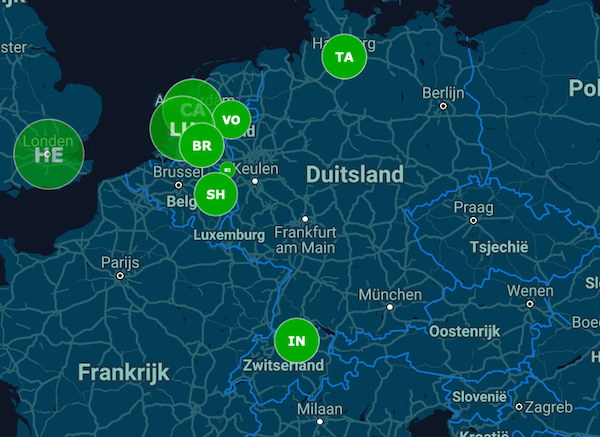

# Realtime Event Map (REM)
This application shows a visually attractive and minimalistic realtime map of events with virtually no delay (just a few ms). This is ideal to display location based events, such as pageviews, on a dashboard. It helps user to get a quick feeling of the scale of what is happing and where. This is much more difficult to grasp just looking at raw numbers.

The location is obtained by translating the visitor IP to a geographical coordinates. You can customize the color and the two or three letters (TLA) in the event animations.

The application is set-up for multi-tenancy. By clicking on the "Create map" button a unique map ID is created. You can then connect your own application or website to it and view the events using the customized link. The link is secured with a key/hash so the map url cannot be guessed based on the map id.



## Website / demo
Because the application is so efficient it doesn't need a lot of server resources. Therefore of this I can offer you a hosted version for free.
This is actually all you need, you can create your own map here and connect it on your website without any costs. View the demo on:

http://rem.wouterdewinter.nl/
    
## Technologies
The project uses the following main technologies:

* NodeJs (as webserver)
* React
* Redux
* Websockets (through socket.io)
* Gulp
* Google Maps
* Maxmind GeoLite city

## Sending in events
There are a few ways to send in events:

### Tracking pixel
The easiest way is to use a tracking pixel, the format is:

```html

```

### Javascript
Alternatively you can use javascript to send in an event directly:

```javascript
function rem_hit() {
   var xhttp = new XMLHttpRequest();
   xhttp.open("GET", "https://rem.wouterdewinter.nl/hit?id=[map_id]", true);
   xhttp.send();
}
rem_hit();
```

With all methods you will need to replace [map_id] with your own map id and if you host the application yourself the url of the application. (Use http://localhost:3000/ for development). There are also a few extra get options that you can append to the url.

parameter | description | default | example
--- | --- | --- | ---
color | The color of the circle, hexadecimal without # | f00 | ffaa00
tla | The two (or three) letter acronym to show inside the circle. The tla will limited to three characters and uppercased. Use the special value `_referer` to automatically use the HTTP referer as tla | `empty` | xx

An example with all parameters set:
    
    https://rem.wouterdewinter.nl/img?id=[map_id]&color=ffaa00&tla=xx

## Features

### Auto center
A basic auto-center and auto-scaling of the map is enabled by default. It will scale the map every minute so it will fit the positions of the last 100 events. It will not scale before 100 events have been recorded since the map was opened in the browser.

### URL hashing
The most important variables (map ID, map location, menu visibility, etc) are saved in the URL after the #. With this you can easily open the configured map on another device such as a dashboard. __Tip__: using a url shortener such as goog.gl will save you some typing if you cannot copy/paste directly. 

## Docker
The fastest way to get the application up and running is via docker. It is available on Docker Hub at [wouterdewinter/realtime-event-map](https://hub.docker.com/r/wouterdewinter/realtime-event-map/). To run it type:

    docker run -p 8080:8080 -d wouterdewinter/realtime-event-map --google_maps_api_key=[your_key] --salt=[your_salt]
    
The application will then be available on `http://localhost:8080/`. Please do not forget to replace your own Google Maps API key and change the salt to protect the privacy of your users when using the container in production.

## Installation

### Prerequisites
To get started you need the following:

* Git installed
* Nodejs / npm installed
    
### Follow these steps
1. Clone the repository

        git clone https://github.com/wouterdewinter/realtime-event-map rem

2. Go the application path
        
        cd rem

3. Install the NPM packages

        npm install

4. Copy the config file in `config/config.default.js` to `config/config.js` and follow the instructions in the file to setup your own google maps id (optional) and a security salt

5. Download and unzip the maxmind [GeoLite2 City DB](http://dev.maxmind.com/geoip/geoip2/geolite2/) in the data folder and unzip it

        curl -O http://geolite.maxmind.com/download/geoip/database/GeoLite2-City.mmdb.gz && gunzip GeoLite2-City.mmdb.gz

6. Run the application in development mode. This command will build the application using Gulp, opens the browser and uses browsersync to send code updates to the browser. NodeJs is also automatically restarted when code has changed.

        npm run dev
